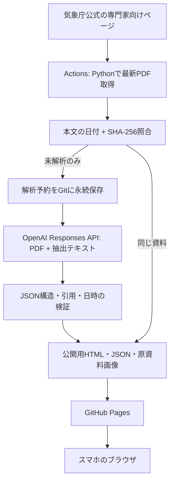

# 航空気象デイリーブリーフィング

気象庁の短期予報解説資料を、**WHAT → WHY → WHERE / WHEN → AVIATION**につなげて読む日本語の学習用Webアプリです。Pythonがクラウドで静的HTMLを生成するため、閲覧時にサーバーやOpenAI APIを起動しません。

## 現在の完成範囲

- 気象庁公式の専門家向けページから最新PDFのリンクを発見し取得。URLを日付等から推測しません。
- 資料名、PDF本文の発表日時、朝夕の対象版、取得URL、取得日時、SHA-256を保存。
- 朝夕2回の更新と各1回の再確認をGitHub Actionsで実行するワークフロー。
- Responses APIへPDFと抽出テキストを送信。PDFの文章とページ画像を使うVision解析。
- 厳密な構造化JSON、引用とページの照合、朝昼夕夜翌朝の日付検証。
- 9つの解説区画、14種の航空現象、因果関係の図、原資料の拡大・縮小・リセット。
- 同一内容の二重解析防止、訂正版対応、課金前の永続予約、月間回数制限、失敗時の前回レポート保持。
- 公開ファイルの許可リスト、秘密文字列の検査、HTMLエスケープ、外部スクリプト不使用。

**未実行：OpenAI APIの実課金解析、GitHubへのリポジトリ作成・設定、Actions上での初回実行、GitHub Pagesへの公開。**
アカウント・APIキー・公開範囲の指定待ちです。ローカル確認画面はクラウド公開URLではなく、自宅PCを止めれば閲覧できません。正式運用は下記のクラウド設定後に開始します。

`site/index.html`は実資料の取得状況と未解析状態を表示します。`site/demo.html`は**架空の表示サンプル**で、API生成結果でも最新予報でもありません。例の内容を実運航や日々の予報として使用しないでください。

## 採用構成



**公開の気象学習レポートでよい場合**にGitHub Repository＋Actions＋Python＋OpenAI＋Pagesを採用します。APIキーはActions Secretsにだけ保存します。Pagesは静的配信のみで、AI処理はしません。

GitHub Freeでは公開リポジトリのPagesを利用できます。通常のPagesには個人向けの閲覧認証がありません。`noindex`は検索エンジンへの希望で、アクセス制御ではありません。非公開リポジトリを使うだけでPagesの閲覧が非公開になるわけでもありません。

**本人だけ閲覧したい場合は、その希望を確認してからCloudflare Access等の認証付き配信へ変更する必要があります。この実装にログイン機能はありません。** 比較と選定理由は [ARCHITECTURE.md](ARCHITECTURE.md) を参照してください。

## 初回クラウド設定

APIキーをチャット、README、コマンド引数、`.env.example`へ貼らないでください。

1. GitHubに専用のリポジトリ（推奨名 `aviation-weather-briefing`）を作成します。公開レポートでよい場合はPublicを選び、このフォルダーの内容を配置します。`work/`、`site/`、`.env`はコミット対象外です。Windowsの隠しフォルダー `.github/` も必ず配置します。
2. **Settings → Secrets and variables → Actions → Secrets** に `OPENAI_API_KEY` を登録します。API利用可能なOpenAIプロジェクトのキーと課金設定が必要です。
3. 同ページの **Variables** に `OPENAI_MODEL` を登録します。初期候補は `gpt-4.1-mini`。画像入力・PDF入力・Structured Outputs対応モデルを指定してください。利用不可の場合に別モデルへ自動変更する処理はありません。
4. 必要ならVariablesに `MAX_MONTHLY_REQUESTS=70`、`MAX_OUTPUT_TOKENS=12000` を登録します。未設定でもこの値を使います。
5. **Settings → Actions → General** でActionsを許可し、このワークフローが既定ブランチへデータをpushできるようにします。ブランチ保護でbotのpushが拒否される場合、この専用リポジトリのデータ保存方針を調整してください。保護を勝手に解除する処理はありません。
6. **Settings → Pages → Build and deployment → Source** を **GitHub Actions** にします。
7. **Actions → Daily aviation weather briefing → Run workflow** を実行します。初回の `retry_failed` はfalseのままにします。
8. 生成ジョブと公開ジョブの成功を確認し、Pagesが表示したHTTPS URLをスマートフォンで開きます。表示URLは通常 `https://<GitHubユーザー名>.github.io/aviation-weather-briefing/` です。実際のURLはPages画面を正としてください。
9. 実資料の発表日時、根拠引用、14種の航空現象、因果関係の図、原資料拡大を確認します。最初の数回はAI解説を原文と照合し、選択したモデルの品質を評価してください。

**以後、自宅PCの常時起動は不要です。** 定時処理はGitHubのクラウドで実行されます。ただしGitHubの定時実行は時刻保証ではなく、遅延・欠落やサービス障害はあり得ます。

## 毎日の時刻（日本時間）

|処理|朝|夕方|
|---|---|---|
|気象庁公式の更新目安|03:40頃|15:40頃|
|このアプリの初回取得|04:17|16:17|
|更新遅れの再確認|05:47|17:47|

スケジュールはUTCで記載済みです。再確認で同じ資料ならAPIを呼びません。資料自体の03:40/15:40という**発表日時**と、05時/17時予報向けという**対象版**は別に保存・表示します。朝版/夕方版は現在の公式運用と本文の発表時間帯に基づく分類です。

気象庁の最新版URLは上書きされます。この実装は公開アーカイブを推測しないため、両方の取得枠を逃すとその版の回収は保証できません。ワークフロー停止中の欠落版を自動で遡及取得する機能はありません。

## 費用を抑える仕組み

- 公開リポジトリ＋標準のGitHubホストランナー＋Pagesを前提に、ホスティングの無料枠を利用する構成です。最新の利用条件は公式サイトで確認してください。
- 正常時のOpenAI呼び出しは最大1資料1回、通常1日2回。閲覧回数によるAPI費用はありません。
- 月間70回の**予約数**上限を設けています。通信失敗でも課金の可能性があるため、失敗・タイムアウトも1回として数えます。
- 例：GPT-4.1 miniの入力$0.40/100万token、出力$1.60/100万tokenという確認時の単価なら、1回に入力10,000・出力8,000token使用した場合、月60回は約 **$1.01**。PDF画像の入力も含めた仮定の計算で、実測値ではありません。税等は含みません。
- 出力上限12,000token、PDF8MB・4ページまで。モデル変更で費用は変わります。回数上限は金額の上限ではありません。
- 実際の`usage`は成功レポートJSONに保存します。通信断等の実際の課金はOpenAIの利用状況と照合してください。

## 解析と信頼性

APIにはPDF自体を`input_file`で送り、`detail=high`を指定しています。OpenAI公式仕様上、Vision対応モデルでは本文とページ画像が処理されます。ローカルのpypdf抽出テキストもページ単位で添付し、引用の照合に使います。原資料が読めない・日付を抽出できない場合は解析を停止します。OCRによる発表日時の推測はしません。

`資料記載`は原文の連続引用とページ番号を必須とし、全半角・空白を正規化して一致を検証します。ただし**引用が実在することと、主張が正しいことは別です**。意味の整合性や気象学的解釈の正確さを機械的に保証するものではありません。

関連高層・数値予報天気図は、公式ページから取得した案内リンクのみです。Phase 1ではそれらを解析した扱いにはしません。上空の各高度、LLWS、ICE、横風、視程、雲底などで根拠不足なら、明確に追加確認と表示します。

このWebアプリは**航空気象の学習補助専用**です。実際の運航判断や公式ブリーフィングの代替にはしません。空港・滑走路・飛行経路の安全性を判定する機能はありません。

## 失敗と復旧

- 取得失敗・JSON不正・引用不一致・拒否・出力途中終了では、正常レポートを上書きしません。画面に更新失敗を表示し、Actionsを失敗扱いにします。
- 課金リクエストの前に予約をGitへpushします。予約保存が失敗するとAPIは呼びません。API後にpushが失敗した場合も、次回は予約が残るため二重呼び出しを自動では行いません。
- APIタイムアウト時は、処理されたか判定できないので自動再送しません。必要な場合だけ手動実行で`retry_failed=true`を選びます。1資料の試行は最大2回です。再試行には再課金の可能性があります。
- 正常に解析済みの同一PDFは、手動再試行でも再解析しません。モデルやプロンプト変更だけで過去資料を自動再解析することはありません。
- 30時間超の古い資料や、保存済みより古い発表日時への巻き戻りでは有料解析を停止します。画面では発表・最終確認から15時間超を経過すると古さを表示します。ユーザー端末の時計を利用します。
- 公開履歴は直近60資料。元のデータと予約台帳はGitに残します。長期運用ではPDFとGit履歴が増えるため、年単位でリポジトリ容量を確認してください。
- GitHubは公開リポジトリに60日間活動がない場合、定時ワークフローを無効化します。この構成では取得確認・生成結果を通常のコミットとして保存しますが、長期停止時はActions画面で有効化が必要です。
- 失敗通知はGitHubのActions通知設定を利用してください。ワークフローそのものが発火しない障害には通知も出ない可能性があります。独立した監視サービスはPhase 1には追加していません。

## ローカル開発

Python 3.12を使用します。例はbashです。WindowsでもPythonのコマンド自体は同じです。

```bash
python -m venv .venv
source .venv/bin/activate
python -m pip install -r requirements.txt
python -m unittest discover -s tests -v

# 無料：公式資料の取得のみ
python -m briefing.pipeline fetch-only
python -m briefing.pipeline build
python -m http.server 8765 --bind 127.0.0.1 --directory site
```

Windowsの仮想環境は `.venv\Scripts\Activate.ps1` で有効化します。`.env`の自動読み込みはしません。APIキーをローカルで使う場合は安全な方法でプロセスの環境変数へ設定してください。

クラウドでは予約の永続保存が`prepare`と`analyze`の間に入ります。ローカルで有料解析をする場合も、`prepare`で予約した`data/state.json`を失わないよう保存してから`analyze`を実行してください。

## ファイル

|場所|役割|
|---|---|
|`briefing/source.py`|公式リンク発見、PDF取得、日時・対象版の抽出|
|`briefing/pipeline.py`|重複防止、月間上限、Responses API、状態保存|
|`briefing/schema.py`|構造化JSONと根拠検証|
|`briefing/prompt.txt`|日本語のインストラクター指示|
|`briefing/render.py` / `web/`|レスポンシブHTMLと操作|
|`briefing/security.py`|公開成果物の許可リスト・秘密検査|
|`data/`|資料・発表日時・検証済みレポート・永続予約台帳|
|`site/`|公開用だけの生成物。APIキー・台帳・ログを含めない|
|`.github/workflows/briefing.yml`|取得、予約保存、解析、公開|
|`tests/`|失敗時挙動・引用・重複・公開境界の検証|

公式情報の調査記録は [ARCHITECTURE.md](ARCHITECTURE.md)、検証状況は [VALIDATION.md](VALIDATION.md) を参照してください。
